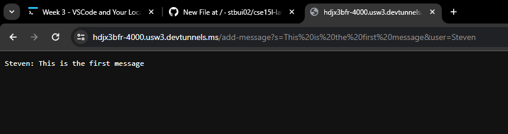
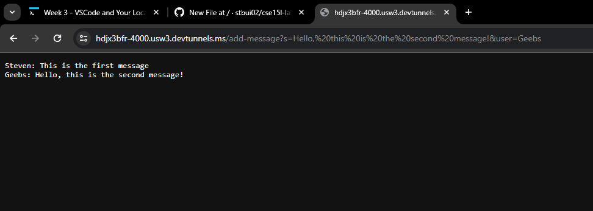

# Lab Report 2

These are the screenshots of my code and these are the screenshots of the two messages.
---

The methods in my code are 
> `handleRequest(URI url)` and `main(String[] args)`.

The relevant arguments and values
---
handleRequst(URI url) Method:
* Argument: url: This is a URI object that represents the URL that the server uses.

* Values of Relevant Fields: chatHistory: A field in the ChatHandler class that is meant to record the chat history. It is updated based on the inputs from the user through the handleRequest method.

main(String[] args) Method:
* Argument: args: An array of strings that in this code is an array that takes the port number.

* Values of Relevant Fields: port: An integer for the port number of the server.

How the values of each relevant field changes from specific requests
---
Request for "/":
* This is the root path.
* No values of the ChatHandler class fields change in this case.
* The method returns the current chatHistory without changing it.

Request for "/add-message":
* The values of the Chathandler class fields do change and uses the values from the url.
* This changes the `chatHistory` field.
  * The `message` is collected from the URL through
    `url.getQuery().split("s=")[1].split("&")[0]`
  * The `user` is collected through
    `url.getQuery().split("user=")[1]`
      
Specifically:
The message is extracted from the query parameters using url.getQuery().split("s=")[1].split("&")[0].
The user is extracted from the query parameters using url.getQuery().split("user=")[1].
The chatHistory is updated by appending the new message with the user's name.
Request for an Unknown Path (Not "/", Not "/add-message"):

No values of the ChatHandler class fields change in this case.
The method returns a "404 Not Found!" message without modifying the chatHistory.
