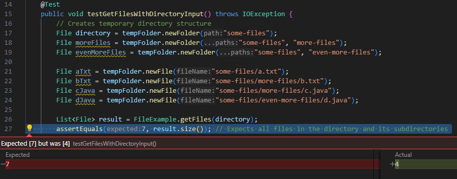
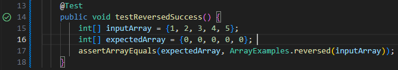

# Lab Report 3
## Part 1
---

This is the failure-inducing JUnit test:
```
@Test
    public void testReversedFailure() {
        int[] inputArray = {1, 2, 3, 4, 5};
        int[] expectedArray = {5, 4, 3, 2, 1};
        assertArrayEquals(expectedArray, ArrayExamples.reversed(inputArray));
    }
```

This is the JUnit test that passes:
```
@Test
    public void testReversedSuccess() {
        int[] inputArray = {1, 2, 3, 4, 5};
        int[] expectedArray = {0, 0, 0, 0, 0}; // This is what the original buggy code would return
        assertArrayEquals(expectedArray, ArrayExamples.reversed(inputArray));
    }
```

Screenshots of the outputs from running the tests:

Failed-




Passed-



The bug I chose from week 4's lab is from ArrayExamples.java, specifically the reversed method, which is below

---
```
static int[] reversed(int[] arr) {
    int[] newArray = new int[arr.length];
    for(int i = 0; i < arr.length; i += 1) {
      arr[i] = newArray[arr.length - i - 1];
    }
    return arr;
  }
```
The issue here is in the for loop:
```
arr[i] = newArray[arr.length - i - 1];
```
The statement initializes "newArray" as an array of zeros and assigns this to arr[i]. This bug causes arr always to be written as an array of zeros instead of reversing.

This is the fixed code below
```
static int[] reversedFixed(int[] arr) {
    int[] newArray = new int[arr.length];
    for(int i = 0; i < arr.length; i += 1) {
      newArray[i] = arr[arr.length - i - 1];
    }
    return newArray;
  }
```
The fixed code contains the corrected statement:
```
newArray[i] = arr[arr.length - i - 1];
```
This assigns the value of `arr[arr.length - i - 1]`, the reversed array, to newArray which is then returned.

## Part 2
---

I chose `find` for my command.
The four ways to use this command that I chose are:

```
find . -type
find . -name
find . -size
find . -cmin
```
---
`find. -type` searches for different file types depending on the user's input.

For `find. -type` the two examples are:

1.
```
Steven@DESKTOP-1AA65ED MINGW64 ~/Documents/GitHub/docsearch (main)
$ find . -type d
.
./.git
./.git/hooks
./.git/info
./.git/logs
./.git/logs/refs
./.git/logs/refs/heads
./.git/logs/refs/remotes
./.git/logs/refs/remotes/origin
./.git/objects
./.git/objects/info
./.git/objects/pack
```
For `-type d` it will find directories.

2.
```
Steven@DESKTOP-1AA65ED MINGW64 ~/Documents/GitHub/docsearch (main)
$ find . -type f
./.git/config
./.git/description
./.git/FETCH_HEAD
./.git/HEAD
./.git/hooks/applypatch-msg.sample
./.git/hooks/commit-msg.sample
./.git/hooks/fsmonitor-watchman.sample
./.git/hooks/post-update.sample
./.git/hooks/pre-applypatch.sample
./.git/hooks/pre-commit.sample
./.git/hooks/pre-merge-commit.sample
```
For `-type f` it will find files within the directories.
This command prints out a lot more lines after this.

---

`find. -name` searches for files based on their name.
For `find. -name` the two examples are:

1.
```
Steven@DESKTOP-1AA65ED MINGW64 ~/Documents/GitHub/docsearch (main)
$ find . -name "*.txt"
./technical/911report/chapter-1.txt
./technical/911report/chapter-10.txt
./technical/911report/chapter-11.txt
./technical/911report/chapter-12.txt
./technical/911report/chapter-13.1.txt
./technical/911report/chapter-13.2.txt
./technical/911report/chapter-13.3.txt
./technical/911report/chapter-13.4.txt
```
For `find . -name "*.txt"` this will search for all files with the .txt extension in the current directory.
This command prints out a lot more lines after this.

2. 
```
Steven@DESKTOP-1AA65ED MINGW64 ~/Documents/GitHub/docsearch (main)
$ find . -name "chapter*"
./technical/911report/chapter-1.txt
./technical/911report/chapter-10.txt
./technical/911report/chapter-11.txt
./technical/911report/chapter-12.txt
./technical/911report/chapter-13.1.txt
./technical/911report/chapter-13.2.txt
./technical/911report/chapter-13.3.txt
./technical/911report/chapter-13.4.txt
./technical/911report/chapter-13.5.txt
./technical/911report/chapter-2.txt
./technical/911report/chapter-3.txt
./technical/911report/chapter-5.txt
./technical/911report/chapter-6.txt
./technical/911report/chapter-7.txt
./technical/911report/chapter-8.txt
./technical/911report/chapter-9.txt
```
For `find . -name "chapter*"` this will search for all files starting with "chapter" in the current directory.

---

For `find. -size` the two examples are:

1.
```
Steven@DESKTOP-1AA65ED MINGW64 ~/Documents/GitHub/docsearch (main)
$ find . -size +1M
./.git/objects/pack/pack-f3e64844a2bd252cbb7d4b547cb60beb349fd441.pack
```
For `find. -size +1M` the command searches for files larger than 1 "mebibyte".

2.
```
Steven@DESKTOP-1AA65ED MINGW64 ~/Documents/GitHub/docsearch (main)
$ find . -size -1M
.
./.git
./.git/hooks
./.git/info
./.git/logs
./.git/logs/refs
./.git/logs/refs/heads
./.git/logs/refs/remotes
./.git/logs/refs/remotes/origin
./.git/objects
./.git/objects/info
./.git/objects/pack
./.git/refs
./.git/refs/heads
./.git/refs/remotes
./.git/refs/remotes/origin
./.git/refs/tags
./lib
./technical
./technical/911report
./technical/biomed
./technical/government
./technical/government/About_LSC
./technical/government/Alcohol_Problems
./technical/government/Env_Prot_Agen
./technical/government/Gen_Account_Office
./technical/government/Media
./technical/government/Post_Rate_Comm
./technical/plos
```
For `find. -size -1M` the command searches for files smaller than 1 "mebibyte".

---

For `find. -cmin` the two examples are:

1. 
```
Steven@DESKTOP-1AA65ED MINGW64 ~/Documents/GitHub/docsearch (main)
$ find . -cmin -1
```

2. 
```
Steven@DESKTOP-1AA65ED MINGW64 ~/Documents/GitHub/docsearch (main)
$ find . -cmin -10
./.git/FETCH_HEAD
./.git/logs/refs/remotes/origin/HEAD
./.git/objects
./.git/refs/remotes/origin
./.git/refs/remotes/origin/HEAD
```

For both of the `find. -cmin` commands, they search for files created within the last however many minutes the user inputs.

---

## CITATION

I used the example provided in the Week 5 Lab Report instructions and just searched “find command-line options” on Google.
After searching, I clicked on the first link [Link](https://man7.org/linux/man-pages/man1/find.1.html) which provided me with everything I needed.
