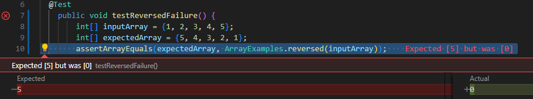

# Lab Report 3
## Part 1
---

This is the failure-inducing JUnit test:
```
@Test
    public void testReversedFailure() {
        int[] inputArray = {1, 2, 3, 4, 5};
        int[] expectedArray = {5, 4, 3, 2, 1};
        assertArrayEquals(expectedArray, ArrayExamples.reversed(inputArray));
    }
```

This is the JUnit test that passes:
```
@Test
    public void testReversedSuccess() {
        int[] inputArray = {1, 2, 3, 4, 5};
        int[] expectedArray = {0, 0, 0, 0, 0}; // This is what the original buggy code would return
        assertArrayEquals(expectedArray, ArrayExamples.reversed(inputArray));
    }
```

Screenshots of the outputs from running the tests:

Failed-


Passed-

The bug I chose from week 4's lab is from ArrayExamples.java, specifically the reversed method, which is below

---
```
static int[] reversed(int[] arr) {
    int[] newArray = new int[arr.length];
    for(int i = 0; i < arr.length; i += 1) {
      arr[i] = newArray[arr.length - i - 1];
    }
    return arr;
  }
```
The issue here is that it only adds the starting directory to the list and then adds all the files. This results in duplicate entries and an incorrect count when running tests.

This is the after code below
```
import java.io.File;
import java.io.IOException;
import java.util.ArrayList;
import java.util.List;

public class FileExample {

    static List<File> getFiles(File start) throws IOException {
        List<File> result = new ArrayList<>();
        collectFiles(start, result);
        return result;
    }

    private static void collectFiles(File directory, List<File> fileList) {
        fileList.add(directory); // Adds the directory itself to the list
        File[] files = directory.listFiles();
        if (files != null) {
            for (File file : files) {
                if (file.isDirectory()) {
                    collectFiles(file, fileList);
                } else {
                    fileList.add(file);
                }
            }
        }
    }
}
```

