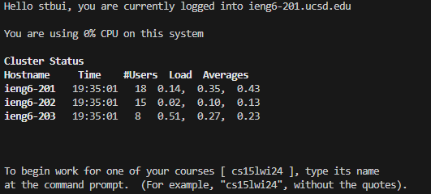
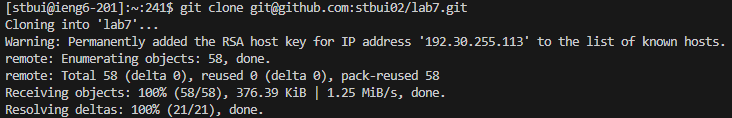
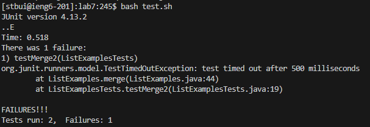
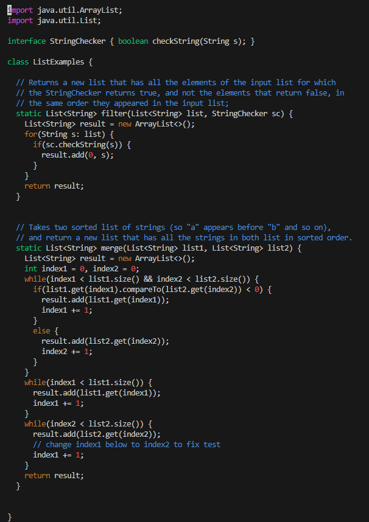
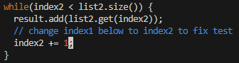
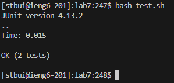
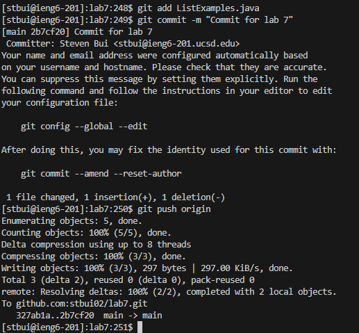

# Lab Report 4
## 1. Login
   
   
   
   Here I typed `ssh stbui@ieng6.ucsd.edu` and pressed `<enter>` to sign into a computer at school.
## 2. Cloning with SSH link

   
   
   After forking the Lab 7 repository to my Github account and adding the public key from the ieng6 computers I was able to clone the Lab 7 repository into the ieng6 computers by typing `git clone git@github.com:ucsd-cse15l-s23/lab7.git` and pressed `<enter>`.
## 3. Tests Demonstrating Failure

   

   This test was run while in the `lab7/` directory. After typing `bash test.sh` and `enter` the screenshot above is printed and the test results are shown.
## 4. Edit Code for Success
   

   In order to view the bugged code, I typed `vim ListExamples.java` and pressed `<enter>`. 
   
   

   In order to correct the bug I pressed these buttons
   1. `<down>` `<down>` `<down>` `<down>` `<down>` `<down>` `<down>` `<down>` `<down>` `<down>` `<down>` `<down>` `<down>` `<down>` `<down>` `<down>` `<down>` `<down>` `<down>` `<down>` `<down>` `<down>` `<down>` `<down>` `<down>` `<down>` `<down>` `<down>` `<down>` `<down>` `<down>` `<down>` `<down>` `<down>` `<down>` `<down>` `<down>` `<down>` `<down>` `<down>` `<down>` `<down>` `<down>` or `<down>` 43 times
   2. `<right>` `<right>` `<right>` `<right>` `<right>` `<right>` `<right>` `<right>` `<right>` `<right>` `<right>` or `<right>` 11 times
   3. `<x>` to remove the "1" from `index1`,
   4. `<i>` to enter insert mode
   5. `<2>` in insert mode to type "2" changing `index1` to `index2`
   6. `<esc>` to leave insert mode
   7. Typed `:wq` and pressed `<enter>` to save the file and leave the vim editor.

## 5. Tests Demonstrating Success

   

   This screenshot shows the test after fixing the buggy code.
   This test was again run while in the `lab7/` directory. After typing `bash test.sh` and `enter` the screenshot above is printed and the test results are shown.
## 6. Adding and Committing Files
    
   
   
   To add and commit the changes made to `ListExamples.java` I typed:
   1. `git add ListExamples.java` This adds the file to the staging area.
   2. `git commit -m "Commit for lab 7"` This commits the files with the message "Commit for lab 7".
   3. `git push origin` This pushes the changes from the local repository to the remote repository the local repository was cloned from.

