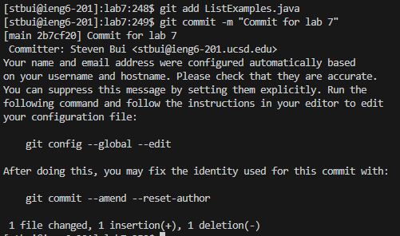

# Lab Report 4
## 1. Login
   
   
   
   Here I typed `ssh stbui@ieng6.ucsd.edu` and `<enter>` to sign into a computer at school.
## 2. Cloning with SSH link

   
   
   After forking the Lab 7 repository to my Github account and adding the public key from the ieng6 computers I was able to clone the Lab 7 repository into the ieng6 computers by typing `git clone git@github.com:ucsd-cse15l-s23/lab7.git` and `<enter>`.
## 3. Tests Demonstrating Failure

   

   This test was run while in the `lab7/` directory. After typing `bash test.sh` and `enter` the screenshot above is printed and the test results are shown.
## 4. Edit Code for Success
   
   
   

   
## 5. Tests Demonstrating Success

   
## 6. Adding and Committing Files
    
   
