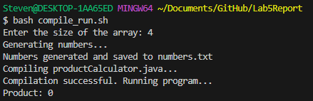
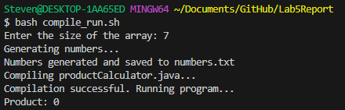
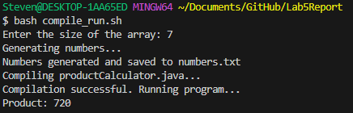
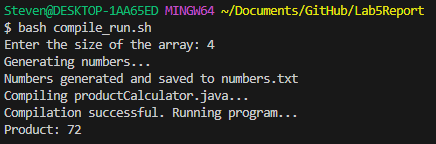

# Lab Report 5
## 1. Original Post

Hello everyone,

I've been working on this Java program, ProductCalculator, and I'm encountering an issue.
When I run the program, it gives me an unexpected result for the product of the numbers.
I think there might be a bug in my calculateProduct method because the product is always coming out as zero, even though the numbers in the input file are not all zeros.
I'm not sure what's causing this. I'll paste some images of the output below. Any help would be appreciated!


 

Thanks!

## 2. TA's Response

Hey there!

Thanks for reaching out. If the code for the multiplication is correct then you may be initializing a variable to 0 in your calculateProduct method or the method you are using to generate numbers is creating 0's. 
Multiplying any number by 0 will always result in 0. You may have to check for mathematical or initializing errors in your calculateProduct method.

## 3. Bug Fix and Original Poster Response

Hello [TA],

Thank you for your suggestion! I originally initialized product to 0 and implemented the change of initializing product to 1 instead.
The product is now calculated correctly, and I'm no longer getting a result of 0. I'll add some screenshots of the result after the changes below.


 

Thank you!

## 4. All the Info

The file & directory structure needed:
Lab5Report/

  │
  
  ├── compile_run.sh
  
  │
  
  ├── numbers.txt
  
  │
  
  ├── productCalculator.java
  
  │
  
  └── productCalculator.class
  

In compile_run.sh:
```
# Clear the contents of numbers.txt if it exists
if [ -f "numbers.txt" ]; then
    rm numbers.txt
fi

# Prompt the user for the size of the array
read -p "Enter the size of the array: " size

# Generate a file with random numbers in the current directory
echo "Generating numbers..."
for i in $(seq "$size"); do
    number=$((RANDOM % 5 + 1)) 
    echo $number >> numbers.txt
done
echo "Numbers generated and saved to numbers.txt"

# Compile the Java program
echo "Compiling productCalculator.java..."
javac productCalculator.java

# Check if compilation was successful
if [ $? -eq 0 ]; then
    echo "Compilation successful. Running program..."
    # Run the Java program
    java productCalculator
else
    echo "Compilation failed. Please check your code."
fi
```

In productCalculator.java:
```
import java.io.File;
import java.io.FileNotFoundException;
import java.util.Scanner;

public class productCalculator {
    public static void main(String[] args) {
        int[] numbers = readNumbersFromFile("numbers.txt");
        if (numbers != null) {
            int product = calculateProduct(numbers);
            System.out.println("Product: " + product);
        } else {
            System.out.println("Failed to read numbers from file.");
        }
    }

    private static int[] readNumbersFromFile(String fileName) {
        try {
            File file = new File(fileName);
            Scanner scanner = new Scanner(file);

            int size = 0;
            while (scanner.hasNextLine()) {
                scanner.nextLine();
                size++; 
            }
            scanner.close();

            int[] numbers = new int[size];
            scanner = new Scanner(file);
            for (int i = 0; i < size; i++) {
                numbers[i] = Integer.parseInt(scanner.nextLine());
            }
            scanner.close();

            return numbers;
        } catch (FileNotFoundException e) {
            System.out.println("File not found!");
            return null;
        }
    }

    private static int calculateProduct(int[] numbers) {
        int product = 0; //Error Here
        for (int number : numbers) {
            product *= number;
        }
        return product;
    }
    
}
```

To run the code I used bash compile_run.sh.

The change was made to this loop:

```
private static int calculateProduct(int[] numbers) {
        int product = 0; //Error Here
        for (int number : numbers) {
            product *= number;
        }
        return product;
    }
```

The fix:

```
private static int calculateProduct(int[] numbers) {
        int product = 1; //Changed to 1
        for (int number : numbers) {
            product *= number;
        }
        return product;
    }
```
As multiplying anything by 0 results in 0 the product being initialized to 0 causes that error.
